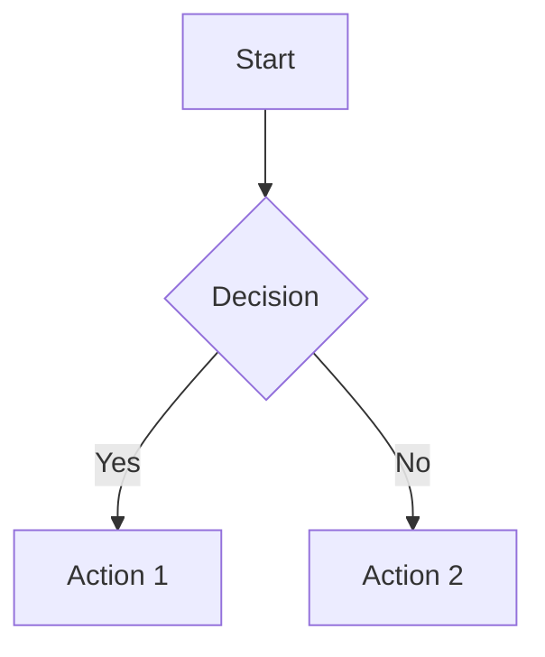
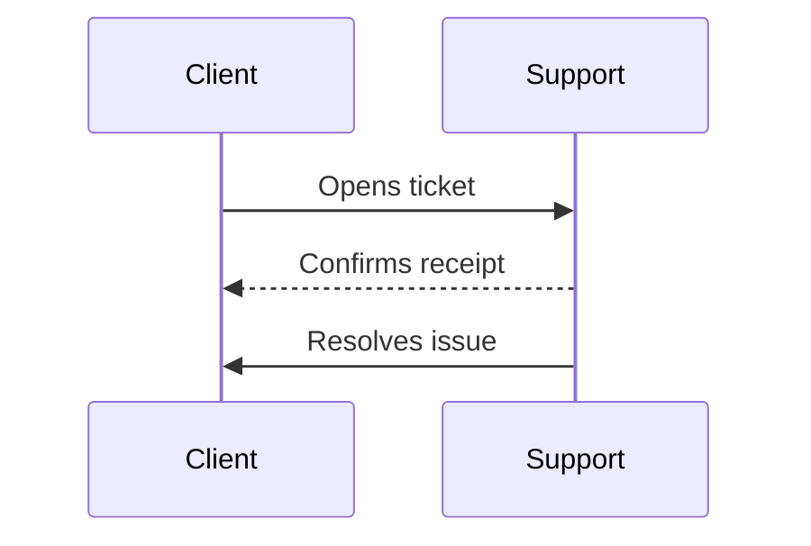

# Creating Documentation Pages

This file contains instructions for creating documentation pages in the Velzani internal docs system.

## File Location

All documentation files should be placed in:

```
wp-content/plugins/velzani-docs/docs/
```

## File Naming Convention

Files use a numeric prefix to control the order in which they appear in the sidebar menu:

- `10-welcome.md` - First page
- `20-support.md` - Second page
- `30-topic.md` - Third page
- etc.

Use increments of 10 to allow inserting pages between existing ones without renaming multiple files.

## Document Structure

### Title (H1)

Each document must start with a single H1 heading (`#`) that serves as the page title:

```markdown
# Page Title
```

### Sections (H2)

Use H2 headings (`##`) for main sections. These appear in the sidebar navigation:

```markdown
## Section Name
```

### Subsections (H3)

Use H3 headings (`###`) for subsections within a section:

```markdown
### Subsection Name
```

## Content Formatting

### Text Emphasis

- **Bold**: `**text**`
- *Italic*: `*text*`

### Lists

Unordered lists:

```markdown
- Item one
- Item two
- Item three
```

Ordered lists:

```markdown
1. First step
2. Second step
3. Third step
```

### Links

```markdown
[Link text](https://example.com)
```

## Mermaid.js Diagrams

The documentation system supports Mermaid.js for diagrams. Wrap your Mermaid code in a fenced code block with the `mermaid` language identifier:

````markdown

````

### Supported Diagram Types

- **Flowcharts**: Process flows and decision trees
- **Sequence diagrams**: Interactions between systems/people
- **Class diagrams**: Object relationships
- **State diagrams**: State machines
- **Entity Relationship diagrams**: Database schemas
- **Gantt charts**: Project timelines

Example sequence diagram:

````markdown

````

## Language

All documentation should be written in **Brazilian Portuguese** to match the existing content.

## Example Page Template

```markdown
# Título da Página

Breve introdução sobre o conteúdo desta página.

## Primeira Seção

Conteúdo da primeira seção.

- Item de lista
- Outro item

## Segunda Seção

Mais conteúdo aqui.

### Subseção

Detalhes adicionais.

1. Passo um
2. Passo dois
3. Passo três
```
