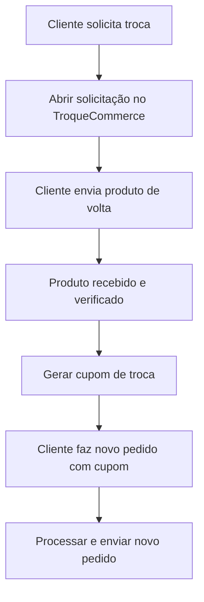

# Suporte ao Cliente

Guia completo para atendimento ao cliente da Velzani, incluindo trocas, devoluções, problemas comuns e dicas práticas.

## Canais de Atendimento

- **WhatsApp:** Canal principal de atendimento. Número da empresa: usar o link `wa.me/55XXXXXXXXXXX` (sem o +).
- **Chat no site (Wati):** Atendimento em tempo real.
- **Reclame Aqui:** Monitorar e responder contestações.
- **Mercado Pago:** Acompanhar contestações de pagamento.

## Dicas para Atendimento

### Gerenciamento de Chats

- Ao encerrar um chat, **favoritá-lo** se houver informação importante ou follow-up necessário. Isso garante que você não perde o histórico e consegue retornar ao cliente posteriormente.
- Para clientes que querem comprar mas não finalizaram, anote para fazer follow-up depois.

### Verificação de Estoque

Para verificar estoque rapidamente, use a página de produtos estruturados:

1. Acesse: [prod-ops.velzani.com/wp-admin/admin.php?page=velzani-structured-products](https://prod-ops.velzani.com/wp-admin/admin.php?page=velzani-structured-products)
2. Clique em **"Expandir tudo"**
3. Use a busca do navegador (Ctrl+F / Cmd+F) para encontrar o produto

### Resolução de Problemas no Site

Sempre que um cliente reportar erro no site:

1. **Peça para tentar em janela anônima** (aba privada) do navegador. Muitas vezes resolve problemas de cache.
2. Se o erro persistir, **tente reproduzir o problema** usando os dados do cliente (endereço, CEP, etc.).
3. Se você conseguir reproduzir, escale para o time técnico com detalhes do erro.
4. Se não conseguir reproduzir, o problema provavelmente é local do cliente.

## Trocas e Devoluções

### Prazos

- **Devoluções com reembolso:** 7 dias corridos após o recebimento (prazo legal).
- **Trocas por outro modelo/tamanho:** Até 30 dias (podemos ser flexíveis até 3 meses, caso a caso, desde que o produto esteja em perfeitas condições e sem marcas de uso).

### Processo de Troca

1. O cliente solicita a troca pelo TroqueCommerce.
2. Acompanhar o status da devolução.
3. Ao receber o produto de volta, gerar o cupom de troca no sistema.
4. Comunicar o cupom ao cliente.
5. O cliente faz um novo pedido utilizando o cupom.
6. **Importante:** Cupons de troca devem ter o prefixo **TROCA-** ou **EX-** para monitoramento correto no sistema.

### Processo de Devolução/Estorno

1. Cliente solicita devolução dentro do prazo de 7 dias.
2. Abrir processo no TroqueCommerce.
3. Após recebimento do produto, realizar o estorno:
   - No WooCommerce, alterar o status do pedido para **Reembolsado**.
   - Se o pedido estiver no checkout, clicar em **Apagar** para removê-lo da fila de envio.
4. **Muito importante:** Nunca fazer estorno "manual" no WooCommerce sem realmente processar o reembolso ao cliente. Estorno manual apenas altera o status, mas **NÃO** devolve o dinheiro. Se o status foi alterado manualmente para "Reembolsado", o cliente NÃO recebeu o dinheiro e ainda pode-se seguir com a troca.

### Cancelamento de Pedido

- **Se o pedido estiver como "Processando":** Basta fazer o estorno normalmente no WooCommerce.
- **Se estiver como "Concluído":** O produto já está em rota de envio. Só é possível cancelar se o cliente devolver o produto.

### Estratégia de Retenção

Antes de processar um estorno, tente reverter a situação oferecendo alternativas ao cliente:

- Desconto no próximo pedido.
- Brinde (ex.: chinelo).
- Desconto significativo no pedido atual (ex.: 50% para enviar pelo preço de custo).
- Prioridade em lançamentos futuros.

O objetivo é manter o cliente, pois ele pode converter novamente no futuro.

### Links Úteis para Trocas

- **Últimos Reembolsos:** [elevacalcados.com.br/wp-admin/admin.php?page=velzani-last-refunds](https://elevacalcados.com.br/wp-admin/admin.php?page=velzani-last-refunds)
- **Pedidos de Troca:** [elevacalcados.com.br/wp-admin/admin.php?page=velzani-troca-orders](https://elevacalcados.com.br/wp-admin/admin.php?page=velzani-troca-orders)
- **TroqueCommerce:** [elevacalcados.troquecommerce.com.br](https://elevacalcados.troquecommerce.com.br/)

## Problemas Comuns

### CEP Inválido

Alguns CEPs podem ter mudado ao longo do tempo. Se o cliente não conseguir finalizar a compra:

1. Verifique o CEP no site dos Correios: [buscacepinter.correios.com.br](https://buscacepinter.correios.com.br/app/endereco/index.php)
2. Se o CEP estiver inválido, peça ao cliente para verificar o CEP correto do endereço dele.
3. CEPs podem mudar de tempos em tempos, então mesmo clientes recorrentes podem ter este problema.

### Transportadora Não Entrega na Região

Em alguns casos, a Loggi não cobre determinadas regiões. Nesse cenário:

1. Verifique se realmente não há opção de entrega para o CEP.
2. Informe o cliente sobre a limitação.
3. Busque alternativas quando disponíveis.

### Erro no Pagamento com Cartão

Se o cliente reportar erro ao pagar com cartão:

1. Verifique o status do Mercado Pago: [status.mercadopago.com](https://status.mercadopago.com/)
2. Tente reproduzir o erro no site.
3. Peça para o cliente tentar em janela anônima ou outro dispositivo.
4. Se o problema persistir de forma generalizada, escale para o time técnico.

### Pedido Pago mas Não Aparece no Bling

Pode ser um problema de integração. Informe o time técnico com o número do pedido para verificação. O sistema possui verificações automáticas, mas situações excepcionais podem ocorrer.

### Cliente Pedindo Nota Fiscal para Devolução

Clientes frequentemente pedem a nota fiscal para conseguir despachar o produto nos Correios. Oriente sobre como acessar a NF do pedido no sistema.

## Compra Segura

Se um cliente perguntar sobre segurança na compra, informe:

- Usamos **Mercado Pago** para processamento de pagamentos, que oferece proteção ao comprador.
- Em caso de problemas (como fraude), o cliente pode falar com o emissor do cartão de crédito ou com o próprio Mercado Pago para recuperar o dinheiro.
- Link para compra garantida: [mercadopago.com.br/compragarantida/clientes](https://www.mercadopago.com.br/compragarantida/clientes)
- Também pode compartilhar nosso perfil no **Reclame Aqui** como referência de atendimento.

## Documentação de Casos

Sempre que identificar um problema recorrente ou uma solução nova, documente! A documentação é essencial para:

- Facilitar o treinamento de novos membros da equipe.
- Evitar retrabalho ao esquecer etapas de processos complexos.
- Permitir a automação futura (primeiro documentamos o processo manual, depois automatizamos partes dele).

O ideal é descrever cada processo de forma **granular**, passo a passo, para que qualquer pessoa consiga executá-lo.
