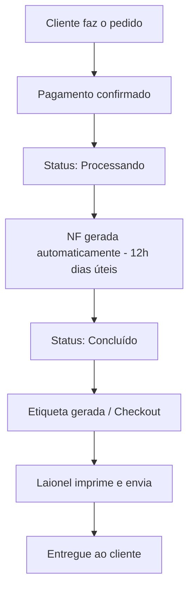
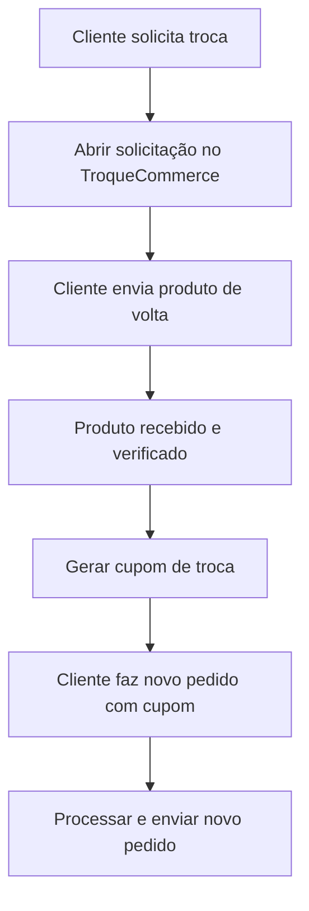

# Suporte e Operações

Guia completo para atendimento ao cliente da Velzani, incluindo gestão de pedidos, trocas, devoluções e problemas comuns.

## Sistemas Principais

- **WooCommerce (Site principal):** [elevacalcados.com.br/wp-admin](https://elevacalcados.com.br/wp-admin) — Gerenciamento de pedidos e configurações da loja.
- **Prod-Ops:** [prod-ops.velzani.com/wp-admin](https://prod-ops.velzani.com/wp-admin) — Gerenciamento de produtos, estoque e ferramentas internas.
- **Bling:** Sistema de emissão de notas fiscais e controle de estoque integrado ao WooCommerce.
- **TroqueCommerce:** [elevacalcados.troquecommerce.com.br](https://elevacalcados.troquecommerce.com.br/) — Gerenciamento de trocas e devoluções.
- **Loggi:** Transportadora principal para envio de pedidos.
- **Mercado Pago:** Processamento de pagamentos e gestão de contestações.

## Canais de Atendimento

- **WhatsApp:** Canal principal de atendimento. Número da empresa: usar o link `wa.me/55XXXXXXXXXXX` (sem o +).
- **Chat no site (Wati):** Atendimento em tempo real.
- **Reclame Aqui:** Monitorar e responder contestações.
- **Mercado Pago:** Acompanhar contestações de pagamento.

## Dicas para Atendimento

### Gerenciamento de Chats

- Ao encerrar um chat, **favoritá-lo** se houver informação importante ou follow-up necessário. Isso garante que você não perde o histórico e consegue retornar ao cliente posteriormente.
- Para clientes que querem comprar mas não finalizaram, anote para fazer follow-up depois.

### Verificação de Estoque

Para verificar estoque rapidamente, use a página de produtos estruturados:

1. Acesse: [prod-ops.velzani.com/wp-admin/admin.php?page=velzani-structured-products](https://prod-ops.velzani.com/wp-admin/admin.php?page=velzani-structured-products)
2. Clique em **"Expandir tudo"**
3. Use a busca do navegador (Ctrl+F / Cmd+F) para encontrar o produto

### Resolução de Problemas no Site

Sempre que um cliente reportar erro no site:

1. **Peça para tentar em janela anônima** (aba privada) do navegador. Muitas vezes resolve problemas de cache.
2. Se o erro persistir, **tente reproduzir o problema** usando os dados do cliente (endereço, CEP, etc.).
3. Se você conseguir reproduzir, escale para o time técnico com detalhes do erro.
4. Se não conseguir reproduzir, o problema provavelmente é local do cliente.

## Gestão de Pedidos

### Fluxo do Pedido

### Geração de Nota Fiscal

As notas fiscais são geradas automaticamente todos os dias úteis ao **meio-dia** (horário de Brasília). Isso significa:

- Pedidos pagos **antes das 12h** terão NF gerada no mesmo dia.
- Pedidos pagos **após as 12h** terão NF gerada no dia útil seguinte.
- Nos **finais de semana**, as NFs acumulam e são geradas na segunda-feira.

### Alteração de Dados do Pedido

A possibilidade de alteração depende do status do pedido:

| Status | Pode Alterar? | O que fazer |
|--------|---------------|-------------|
| **Processando** | ✅ Sim | Altere diretamente no WooCommerce. A alteração será refletida no Bling automaticamente. |
| **Concluído** | ❌ Não | A única opção é tentar contato com a transportadora (Loggi) para solicitar alteração de entrega. |

**Exemplo prático:** Se o cliente errou o número do apartamento e o pedido ainda está como "Processando", você pode corrigir no WooCommerce sem problemas. Se já está "Concluído", a NF já foi gerada e será necessário contatar a Loggi.

### Observações no Pedido

Sempre que houver alguma situação especial (alteração de endereço, problema com cliente, etc.), registre uma **nota no pedido** dentro do WooCommerce. Isso garante que qualquer pessoa consiga entender o histórico do pedido no futuro.

### Pedidos Zerados no Checkout

Pedidos que aparecem com valor zerado no checkout podem ter diversas causas:

1. **Brindes** que precisam ser enviados.
2. **Trocas antigas** que ainda estão pendentes (sem prefixo TROCA- ou EX-).
3. **Erros de integração** que podem ser removidos.

Antes de excluir qualquer pedido zerado, verifique a origem.

### Atenção com o Bling

Evite editar estados manualmente no Bling. O sistema de integração é sensível a edições manuais e pode causar problemas. Sempre que possível, faça alterações pelo WooCommerce.

## Envio de Pedidos

Os pedidos são processados pelo Laionel no CD (Centro de Distribuição) em Franca/SP:

1. Pedidos aparecem no checkout do Bling após geração da NF.
2. Laionel imprime as etiquetas e separa os produtos.
3. Produtos são embalados e coletados pela transportadora.

**Endereço do CD:** Avenida São Vicente, 7718 — CEP: 14.412-348, Franca/SP.

## Trocas e Devoluções

### Prazos

- **Devoluções com reembolso:** 7 dias corridos após o recebimento (prazo legal).
- **Trocas por outro modelo/tamanho:** Até 30 dias (podemos ser flexíveis até 3 meses, caso a caso, desde que o produto esteja em perfeitas condições e sem marcas de uso).

### Processo de Troca

1. O cliente solicita a troca pelo TroqueCommerce.
2. Acompanhar o status da devolução.
3. Ao receber o produto de volta, gerar o cupom de troca no sistema.
4. Comunicar o cupom ao cliente.
5. O cliente faz um novo pedido utilizando o cupom.
6. **Importante:** Cupons de troca devem ter o prefixo **TROCA-** ou **EX-** para monitoramento correto no sistema.

### Processo de Devolução/Estorno

1. Cliente solicita devolução dentro do prazo de 7 dias.
2. Abrir processo no TroqueCommerce.
3. Após recebimento do produto, realizar o estorno:
   - No WooCommerce, alterar o status do pedido para **Reembolsado**.
   - Se o pedido estiver no checkout, clicar em **Apagar** para removê-lo da fila de envio.
4. **Muito importante:** Nunca fazer estorno "manual" no WooCommerce sem realmente processar o reembolso ao cliente. Estorno manual apenas altera o status, mas **NÃO** devolve o dinheiro. Se o status foi alterado manualmente para "Reembolsado", o cliente NÃO recebeu o dinheiro e ainda pode-se seguir com a troca.

### Cancelamento de Pedido

- **Se o pedido estiver como "Processando":** Basta fazer o estorno normalmente no WooCommerce.
- **Se estiver como "Concluído":** O produto já está em rota de envio. Só é possível cancelar se o cliente devolver o produto.

### Estratégia de Retenção

Antes de processar um estorno, tente reverter a situação oferecendo alternativas ao cliente:

- Desconto no próximo pedido.
- Brinde (ex.: chinelo).
- Desconto significativo no pedido atual (ex.: 50% para enviar pelo preço de custo).
- Prioridade em lançamentos futuros.

O objetivo é manter o cliente, pois ele pode converter novamente no futuro.

## Problemas Comuns

### CEP Inválido

Alguns CEPs podem ter mudado ao longo do tempo. Se o cliente não conseguir finalizar a compra:

1. Verifique o CEP no site dos Correios: [buscacepinter.correios.com.br](https://buscacepinter.correios.com.br/app/endereco/index.php)
2. Se o CEP estiver inválido, peça ao cliente para verificar o CEP correto do endereço dele.
3. CEPs podem mudar de tempos em tempos, então mesmo clientes recorrentes podem ter este problema.

### Transportadora Não Entrega na Região

Em alguns casos, a Loggi não cobre determinadas regiões. Nesse cenário:

1. Verifique se realmente não há opção de entrega para o CEP.
2. Informe o cliente sobre a limitação.
3. Busque alternativas quando disponíveis.

### Erro no Pagamento com Cartão

Se o cliente reportar erro ao pagar com cartão:

1. Verifique o status do Mercado Pago: [status.mercadopago.com](https://status.mercadopago.com/)
2. Tente reproduzir o erro no site.
3. Peça para o cliente tentar em janela anônima ou outro dispositivo.
4. Se o problema persistir de forma generalizada, escale para o time técnico.

### Pedido Pago mas Não Aparece no Bling

Pode ser um problema de integração. Informe o time técnico com o número do pedido para verificação. O sistema possui verificações automáticas, mas situações excepcionais podem ocorrer.

### Cliente Pedindo Nota Fiscal para Devolução

Clientes frequentemente pedem a nota fiscal para conseguir despachar o produto nos Correios. Oriente sobre como acessar a NF do pedido no sistema.

### Cliente Pergunta se a Compra é Segura

Se um cliente perguntar sobre segurança na compra, informe:

- Usamos **Mercado Pago** para processamento de pagamentos, que oferece proteção ao comprador.
- Em caso de problemas (como fraude), o cliente pode falar com o emissor do cartão de crédito ou com o próprio Mercado Pago para recuperar o dinheiro.
- Link para compra garantida: [mercadopago.com.br/compragarantida/clientes](https://www.mercadopago.com.br/compragarantida/clientes)
- Também pode compartilhar nosso perfil no **Reclame Aqui** como referência de atendimento.

### Dúvidas sobre Altura do Calçado

Clientes frequentemente perguntam sobre o aumento de altura dos calçados. A altura total é composta por três partes:

- **Palmilha interna:** Parte que fica em contato com o pé (ex.: 0,2 cm)
- **Calcanheira:** Elevação interna no calcanhar (ex.: 5,2 cm)
- **Solado:** Parte externa que toca o chão (ex.: 4,4 cm)

**Importante ao responder:**

1. Cada modelo tem medidas específicas — consulte a página do produto para informar os valores corretos.
2. Explique que pode haver uma **pequena variação** nas medidas (± alguns milímetros) por ser um produto artesanal.
3. O **peso do usuário** e o **uso constante** podem causar uma leve compressão na palmilha e calcanheira ao longo do tempo, reduzindo minimamente a altura final.

**Exemplo de resposta:**

> "Este modelo tem aproximadamente X cm de aumento, sendo: palmilha interna (X cm), calcanheira (X cm) e solado (X cm). Vale lembrar que pode haver uma pequena variação por ser produção artesanal, e com o uso diário a altura pode reduzir levemente devido à acomodação natural dos materiais."

## Documentação de Casos

Sempre que identificar um problema recorrente ou uma solução nova, documente! A documentação é essencial para:

- Facilitar o treinamento de novos membros da equipe.
- Evitar retrabalho ao esquecer etapas de processos complexos.
- Permitir a automação futura (primeiro documentamos o processo manual, depois automatizamos partes dele).

O ideal é descrever cada processo de forma **granular**, passo a passo, para que qualquer pessoa consiga executá-lo.

## Feedback de Clientes

Registre feedbacks importantes dos clientes na planilha de feedback:

**[Planilha de Feedback de Clientes](https://docs.google.com/spreadsheets/d/1TOKit2dHIBsTodzUqvVtkV9OUu4kXJmyWp00v4kkMQw/edit?usp=sharing)**

Use para registrar:
- Sugestões de melhorias em produtos
- Reclamações recorrentes
- Elogios relevantes
- Ideias de novos produtos ou funcionalidades
- Qualquer insight valioso vindo do atendimento

Esses feedbacks ajudam a equipe de produto a entender as necessidades dos clientes e priorizar melhorias.

Quanto mais feedback, melhor. Não tem limite de feedback ou algo assim.

## Links Rápidos

- **Últimos Reembolsos:** [elevacalcados.com.br/wp-admin/admin.php?page=velzani-last-refunds](https://elevacalcados.com.br/wp-admin/admin.php?page=velzani-last-refunds)
- **Pedidos de Troca:** [elevacalcados.com.br/wp-admin/admin.php?page=velzani-troca-orders](https://elevacalcados.com.br/wp-admin/admin.php?page=velzani-troca-orders)
- **Pedidos Bling:** [prod-ops.velzani.com/wp-admin/admin.php?page=velzani-bling-orders&show-orders](https://prod-ops.velzani.com/wp-admin/admin.php?page=velzani-bling-orders&show-orders)
- **Busca CEP Correios:** [buscacepinter.correios.com.br](https://buscacepinter.correios.com.br/app/endereco/index.php)
- **TroqueCommerce:** [elevacalcados.troquecommerce.com.br](https://elevacalcados.troquecommerce.com.br/)
- **Status Mercado Pago:** [status.mercadopago.com](https://status.mercadopago.com/)
- **Feedback de Clientes:** [Planilha de Feedback](https://docs.google.com/spreadsheets/d/1TOKit2dHIBsTodzUqvVtkV9OUu4kXJmyWp00v4kkMQw/edit?usp=sharing)
