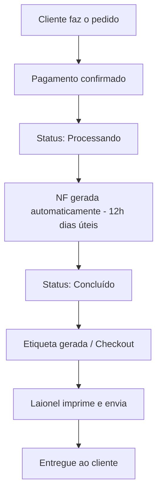
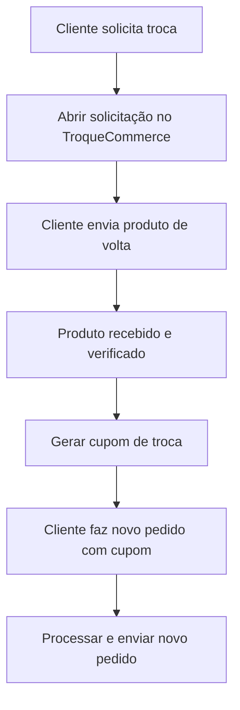

# Suporte e Operações

Guia completo dos processos operacionais da Velzani, incluindo atendimento ao cliente, gestão de pedidos, logística e sistemas internos.

## Sistemas e Acessos

A operação da Velzani utiliza diversos sistemas integrados. Abaixo estão os principais acessos e suas funções:

- **WooCommerce (Site principal):** [elevacalcados.com.br/wp-admin](https://elevacalcados.com.br/wp-admin) — Gerenciamento de pedidos, produtos no site e configurações da loja.
- **Prod-Ops:** [prod-ops.velzani.com/wp-admin](https://prod-ops.velzani.com/wp-admin) — Gerenciamento de produtos, cadastro de variações, fotos e estoque. Inclui ferramentas internas como verificador de imagens, kanban de lançamentos e lista de pedidos Bling.
- **ERP Financeiro:** [erp.velzani.com/wp-admin](https://erp.velzani.com/wp-admin) — Contas a pagar, notas fiscais e controle financeiro.
- **Bling:** Sistema de emissão de notas fiscais e controle de estoque integrado ao WooCommerce.
- **TroqueCommerce:** [elevacalcados.troquecommerce.com.br](https://elevacalcados.troquecommerce.com.br/) — Gerenciamento de trocas e devoluções de clientes.
- **Loggi:** Transportadora principal para envio de pedidos.
- **Clara:** Cartão corporativo virtual utilizado para pagamentos da empresa.
- **Mercado Pago:** Processamento de pagamentos e gestão de contestações.
- **Klaviyo:** Plataforma de e-mail marketing e automações.
- **Amazon Seller Central:** Gestão da loja na Amazon (códigos de verificação enviados por e-mail).

### Diferença entre os Painéis

É importante não confundir os acessos:

- Para **produtos e remessas**, use sempre o Prod-Ops.
- Para **financeiro e contas a pagar**, use o ERP.
- O **site principal** (elevacalcados.com.br) é onde os pedidos são gerenciados no WooCommerce.

## Gestão de Pedidos

### Fluxo do Pedido

### Geração de Nota Fiscal

As notas fiscais são geradas automaticamente todos os dias úteis ao meio-dia (horário de Brasília). Isso significa:

- Pedidos pagos antes das 12h terão NF gerada no mesmo dia.
- Pedidos pagos após as 12h terão NF gerada no dia útil seguinte.
- Nos finais de semana, as NFs acumulam e são geradas na segunda-feira.

### Alteração de Dados do Pedido

- **Status "Processando":** É possível alterar dados como endereço de entrega diretamente no WooCommerce. A alteração será refletida no Bling.
- **Status "Concluído":** Não é mais possível alterar. A única opção é tentar contato com a transportadora (Loggi) para solicitar alteração de entrega.

### Observações no Pedido

Sempre que houver alguma situação especial (alteração de endereço, problema com cliente, etc.), registre uma **nota no pedido** dentro do WooCommerce. Isso garante que qualquer pessoa consiga entender o histórico do pedido no futuro.

### Pedidos Zerados no Checkout

Pedidos que aparecem com valor zerado no checkout podem ter diversas causas: brindes, trocas antigas com problemas, ou erros de integração. Antes de excluir qualquer pedido zerado, verifique:

1. Se é um brinde que precisa ser enviado.
2. Se é uma troca antiga que ainda está pendente.
3. Se é realmente um erro que pode ser removido.

## Trocas e Devoluções

### Prazos

- **Devoluções com reembolso:** 7 dias corridos após o recebimento (prazo legal).
- **Trocas por outro modelo/tamanho:** Até 30 dias (podemos ser flexíveis até 3 meses, caso a caso, desde que o produto esteja em perfeitas condições e sem marcas de uso).

### Processo de Troca

1. O cliente solicita a troca pelo TroqueCommerce.
2. Acompanhar o status da devolução.
3. Ao receber o produto de volta, gerar o cupom de troca no sistema.
4. Comunicar o cupom ao cliente.
5. O cliente faz um novo pedido utilizando o cupom.
6. Cupons de troca devem ter o prefixo **TROCA-** ou **EX-** para monitoramento.

### Processo de Devolução/Estorno

1. Cliente solicita devolução dentro do prazo de 7 dias.
2. Abrir processo no TroqueCommerce.
3. Após recebimento do produto, realizar o estorno:
   - No WooCommerce, alterar o status do pedido para **Reembolsado**.
   - Se o pedido estiver no checkout, clicar em **Apagar** para removê-lo da fila de envio.
4. **Importante:** Nunca fazer estorno "manual" no WooCommerce sem realmente processar o reembolso ao cliente. Estorno manual apenas altera o status, mas NÃO devolve o dinheiro.

### Cancelamento de Pedido

- **Se o pedido estiver como "Processando":** Basta fazer o estorno normalmente no WooCommerce.
- **Se estiver como "Concluído":** O produto já está em rota de envio. Só é possível cancelar se o cliente devolver o produto.

### Estratégia de Retenção

Antes de processar um estorno, tente reverter a situação oferecendo alternativas ao cliente:

- Desconto no próximo pedido.
- Brinde (ex.: chinelo).
- Desconto significativo no pedido atual (ex.: 50% para enviar pelo preço de custo).
- Prioridade em lançamentos futuros.

O objetivo é manter o cliente, pois ele pode converter novamente no futuro.

## Atendimento ao Cliente

### Canais de Atendimento

- **WhatsApp:** Canal principal de atendimento. Número da empresa: usar o link `wa.me/55XXXXXXXXXXX` (sem o +).
- **Chat no site (Wati):** Atendimento em tempo real.
- **Reclame Aqui:** Monitorar e responder contestações.
- **Mercado Pago:** Acompanhar contestações de pagamento.

### Dicas para Atendimento

- Ao encerrar um chat, **favoritá-lo** se houver informação importante ou follow-up necessário.
- Para verificar estoque rapidamente, use a página de produtos estruturados: [prod-ops.velzani.com/wp-admin/admin.php?page=velzani-structured-products](https://prod-ops.velzani.com/wp-admin/admin.php?page=velzani-structured-products) — clique em "Expandir tudo" e busque pelo produto.
- Sempre que um cliente reportar erro no site, peça para ele **tentar em janela anônima** (aba privada) do navegador. Muitas vezes resolve problemas de cache.
- Se o erro persistir, **tente reproduzir o problema** usando os dados do cliente. Se conseguir reproduzir, escale para o time técnico.

### Problemas Comuns

**CEP inválido:** Alguns CEPs podem ter mudado ao longo do tempo. Se o cliente não conseguir finalizar a compra, verifique o CEP no site dos Correios: [buscacepinter.correios.com.br](https://buscacepinter.correios.com.br/app/endereco/index.php)

**Transportadora não entrega na região:** Em alguns casos, a Loggi não cobre determinadas regiões. Nesse cenário, informe o cliente e busque alternativas.

**Pedido pago mas não aparece no Bling:** Pode ser um problema de integração. Informe o time técnico com o número do pedido para verificação. O sistema possui verificações automáticas, mas situações excepcionais podem ocorrer.

## Logística

### Envio de Pedidos

Os pedidos são processados pelo Laionel no CD (Centro de Distribuição) em Franca/SP. O fluxo é:

1. Pedidos aparecem no checkout do Bling após geração da NF.
2. Laionel imprime as etiquetas e separa os produtos.
3. Produtos são embalados e coletados pela transportadora.

### Caixas de Embalagem

As caixas personalizadas são encomendadas do fornecedor Flávio (São Paulo). O processo de pedido:

1. Fazer o pedido das caixas com o Flávio.
2. Agendar coleta com a transportadora.
3. A transportadora coleta as caixas e entrega no CD em Franca (geralmente em 2-3 dias úteis).

### Endereços Importantes

- **CD Velzani (Franca/SP):** Avenida São Vicente, 7718 — CEP: 14.412-348, Franca/SP.
- **Cubbo (Fulfillment):** Estrada Maria Imaculada, 31, Módulo 5A, Jardim Santa Clara, Embu das Artes — SP, 06843-010.

### Fornecedores e Fábricas

- **Rafarillo:** Parceiro de produção de calçados.
- **Ettstec:** Rua Itainópolis, 239 — Bairro Cidade Aracília, CEP 07250-170.
- **Pravini, Naves (BSC):** Outros fornecedores de calçados. Para identificar correspondência entre códigos da NF e modelos internos, consultar o Laionel ou as notas fiscais.

## Cadastro de Produtos

### Painel de Produtos

O cadastro de produtos é feito no Prod-Ops. Ferramentas úteis:

- **Kanban de Lançamentos:** [prod-ops.velzani.com/wp-admin/admin.php?page=velzani-prod-launching-kanban](https://prod-ops.velzani.com/wp-admin/admin.php?page=velzani-prod-launching-kanban)
- **Verificador de Imagens:** [prod-ops.velzani.com/wp-admin/admin.php?page=velzani-image-checker](https://prod-ops.velzani.com/wp-admin/admin.php?page=velzani-image-checker) — Identifica imagens que não estão no formato correto.
- **Produtos Estruturados:** [prod-ops.velzani.com/wp-admin/admin.php?page=velzani-structured-products](https://prod-ops.velzani.com/wp-admin/admin.php?page=velzani-structured-products) — Visão geral de todos os produtos com estoque.

### Status dos Produtos

- **Ativo:** Produto visível no site e pronto para venda.
- **Em desenvolvimento:** Produto em fase de criação/revisão (não visível no site).
- **Aguardando lançamento:** Produto com dados completos, aguardando data de lançamento.

**Importante:** Só coloque um produto como "Ativo" quando TODAS as informações estiverem preenchidas (fotos, preço, custo, descrição, NCM, etc.), pois isso aciona a sincronização com o site.

### Fotos dos Produtos

- As fotos devem ser em **formato quadrado** (1:1) para exibição correta no site.
- Usar **alta resolução** sempre que possível.
- Ao subir fotos pelo WhatsApp, o formato é convertido para JPEG. Para banners e imagens do site, baixe diretamente o arquivo original (preferencialmente WebP).
- Não utilizar a "foto de identificação" no cadastro, pois pode causar bugs de duplicação.

### Edição Simultânea

Se outra pessoa estiver editando o mesmo produto, o WordPress exibirá um aviso. Nesse caso, alinhe com o colega para "tomar a edição" ou aguarde ele terminar.

## Contas a Pagar

### Cadastro de Despesas no ERP

Ao registrar uma despesa no ERP:

1. Escolha a **classificação correta** (ex.: "Logística" para TroqueCommerce).
2. Anexe a **Nota Fiscal** (NF) sempre que possível.
3. Se disponível, prefira enviar o arquivo **XML** ao invés de PDF — o XML preenche os dados automaticamente.
4. Para valores monetários, use a vírgula/ponto **apenas no separador decimal** (ex.: 1480,00 e não 1.480,00).
5. Inclua o link do boleto/Asaas nas observações quando aplicável.

### Cartão Clara

O cartão corporativo Clara pode ser utilizado para pagamentos operacionais. Regras:

- Sempre que fizer um pagamento pelo Clara, faça o upload da documentação de suporte (NF ou recibo) diretamente no sistema da Clara.
- Para pagamentos nacionais: enviar NF.
- Para pagamentos internacionais: enviar recibo.
- Caso precise de aumento de limite, solicite aprovação.

## Links Rápidos para o Dia a Dia

- **Últimos Reembolsos:** [elevacalcados.com.br/wp-admin/admin.php?page=velzani-last-refunds](https://elevacalcados.com.br/wp-admin/admin.php?page=velzani-last-refunds)
- **Pedidos de Troca:** [elevacalcados.com.br/wp-admin/admin.php?page=velzani-troca-orders](https://elevacalcados.com.br/wp-admin/admin.php?page=velzani-troca-orders)
- **Pedidos Bling:** [prod-ops.velzani.com/wp-admin/admin.php?page=velzani-bling-orders&show-orders](https://prod-ops.velzani.com/wp-admin/admin.php?page=velzani-bling-orders&show-orders)
- **Configurações do Tema:** [elevacalcados.com.br/wp-admin/admin.php?page=velzani-theme-settings](https://elevacalcados.com.br/wp-admin/admin.php?page=velzani-theme-settings)
- **Busca CEP Correios:** [buscacepinter.correios.com.br](https://buscacepinter.correios.com.br/app/endereco/index.php)
- **TroqueCommerce:** [elevacalcados.troquecommerce.com.br](https://elevacalcados.troquecommerce.com.br/)

## Documentação de Processos

Sempre que identificar um processo novo ou uma solução para um problema recorrente, documente! A documentação é essencial para:

- Facilitar o treinamento de novos membros da equipe.
- Evitar retrabalho ao esquecer etapas de processos complexos.
- Permitir a automação futura (primeiro documentamos o processo manual, depois automatizamos partes dele).

O ideal é descrever cada processo de forma **granular**, passo a passo, para que qualquer pessoa consiga executá-lo.
