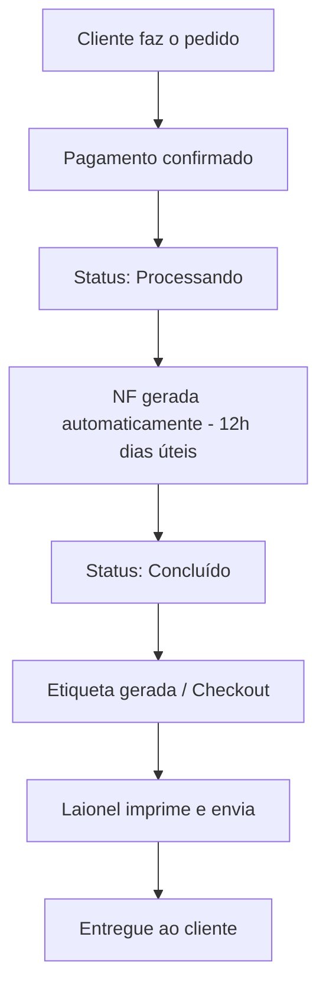

# Operações

Guia completo dos processos operacionais da Velzani, incluindo gestão de pedidos, logística, cadastro de produtos e contas a pagar.

## Sistemas e Acessos

A operação da Velzani utiliza diversos sistemas integrados. Abaixo estão os principais acessos e suas funções:

- **WooCommerce (Site principal):** [elevacalcados.com.br/wp-admin](https://elevacalcados.com.br/wp-admin) — Gerenciamento de pedidos, produtos no site e configurações da loja.
- **Prod-Ops:** [prod-ops.velzani.com/wp-admin](https://prod-ops.velzani.com/wp-admin) — Gerenciamento de produtos, cadastro de variações, fotos e estoque. Inclui ferramentas internas como verificador de imagens, kanban de lançamentos e lista de pedidos Bling.
- **ERP Financeiro:** [erp.velzani.com/wp-admin](https://erp.velzani.com/wp-admin) — Contas a pagar, notas fiscais e controle financeiro.
- **Bling:** Sistema de emissão de notas fiscais e controle de estoque integrado ao WooCommerce.
- **TroqueCommerce:** [elevacalcados.troquecommerce.com.br](https://elevacalcados.troquecommerce.com.br/) — Gerenciamento de trocas e devoluções de clientes.
- **Loggi:** Transportadora principal para envio de pedidos.
- **Clara:** Cartão corporativo virtual utilizado para pagamentos da empresa.
- **Mercado Pago:** Processamento de pagamentos e gestão de contestações.
- **Klaviyo:** Plataforma de e-mail marketing e automações.
- **Amazon Seller Central:** Gestão da loja na Amazon (códigos de verificação enviados por e-mail).

### Diferença entre os Painéis

É importante não confundir os acessos:

- Para **produtos e remessas**, use sempre o Prod-Ops.
- Para **financeiro e contas a pagar**, use o ERP.
- O **site principal** (elevacalcados.com.br) é onde os pedidos são gerenciados no WooCommerce.

## Gestão de Pedidos

### Fluxo do Pedido

### Geração de Nota Fiscal

As notas fiscais são geradas automaticamente todos os dias úteis ao **meio-dia** (horário de Brasília). Isso significa:

- Pedidos pagos **antes das 12h** terão NF gerada no mesmo dia.
- Pedidos pagos **após as 12h** terão NF gerada no dia útil seguinte.
- Nos **finais de semana**, as NFs acumulam e são geradas na segunda-feira.

### Alteração de Dados do Pedido

A possibilidade de alteração depende do status do pedido:

| Status | Pode Alterar? | O que fazer |
|--------|---------------|-------------|
| **Processando** | ✅ Sim | Altere diretamente no WooCommerce. A alteração será refletida no Bling automaticamente. |
| **Concluído** | ❌ Não | A única opção é tentar contato com a transportadora (Loggi) para solicitar alteração de entrega. |

**Exemplo prático:** Se o cliente errou o número do apartamento e o pedido ainda está como "Processando", você pode corrigir no WooCommerce sem problemas. Se já está "Concluído", a NF já foi gerada e será necessário contatar a Loggi.

### Observações no Pedido

Sempre que houver alguma situação especial (alteração de endereço, problema com cliente, etc.), registre uma **nota no pedido** dentro do WooCommerce. Isso garante que qualquer pessoa consiga entender o histórico do pedido no futuro.

Há também a opção de enviar a nota diretamente ao cliente como comunicação oficial, se necessário.

### Pedidos Zerados no Checkout

Pedidos que aparecem com valor zerado no checkout podem ter diversas causas:

1. **Brindes** que precisam ser enviados.
2. **Trocas antigas** que ainda estão pendentes (sem prefixo TROCA- ou EX-).
3. **Erros de integração** que podem ser removidos.

Antes de excluir qualquer pedido zerado, verifique a origem. Pedidos zerados de troca precisam ter a natureza de operação correta para serem enviados normalmente.

## Logística

### Envio de Pedidos

Os pedidos são processados pelo Laionel no CD (Centro de Distribuição) em Franca/SP. O fluxo é:

1. Pedidos aparecem no checkout do Bling após geração da NF.
2. Laionel imprime as etiquetas e separa os produtos.
3. Produtos são embalados e coletados pela transportadora.

### Caixas de Embalagem

As caixas personalizadas são encomendadas do fornecedor Flávio (São Paulo). O processo de pedido:

1. Fazer o pedido das caixas com o Flávio.
2. Agendar coleta com a transportadora.
3. A transportadora coleta as caixas e entrega no CD em Franca (geralmente em 2-3 dias úteis).

### Endereços Importantes

- **CD Velzani (Franca/SP):** Avenida São Vicente, 7718 — CEP: 14.412-348, Franca/SP.
- **Cubbo (Fulfillment):** Estrada Maria Imaculada, 31, Módulo 5A, Jardim Santa Clara, Embu das Artes — SP, 06843-010.

### Fornecedores e Fábricas

- **Rafarillo:** Parceiro de produção de calçados.
- **Ettstec:** Rua Itainópolis, 239 — Bairro Cidade Aracília, CEP 07250-170.
- **Pravini, Naves (BSC):** Outros fornecedores de calçados. Para identificar correspondência entre códigos da NF e modelos internos, consultar o Laionel ou as notas fiscais.

### Pedidos Bling

- **Lista de Pedidos Bling:** [prod-ops.velzani.com/wp-admin/admin.php?page=velzani-bling-orders&show-orders](https://prod-ops.velzani.com/wp-admin/admin.php?page=velzani-bling-orders&show-orders)

**Atenção com o Bling:** Evite editar estados manualmente no Bling. O sistema de integração é sensível a edições manuais e pode causar problemas. Sempre que possível, faça alterações pelo WooCommerce ou pelo sistema interno.

## Cadastro de Produtos

### Painel de Produtos

O cadastro de produtos é feito no Prod-Ops. Ferramentas úteis:

- **Kanban de Lançamentos:** [prod-ops.velzani.com/wp-admin/admin.php?page=velzani-prod-launching-kanban](https://prod-ops.velzani.com/wp-admin/admin.php?page=velzani-prod-launching-kanban)
- **Verificador de Imagens:** [prod-ops.velzani.com/wp-admin/admin.php?page=velzani-image-checker](https://prod-ops.velzani.com/wp-admin/admin.php?page=velzani-image-checker) — Identifica imagens que não estão no formato correto.
- **Produtos Estruturados:** [prod-ops.velzani.com/wp-admin/admin.php?page=velzani-structured-products](https://prod-ops.velzani.com/wp-admin/admin.php?page=velzani-structured-products) — Visão geral de todos os produtos com estoque.

### Status dos Produtos

- **Ativo:** Produto visível no site e pronto para venda.
- **Em desenvolvimento:** Produto em fase de criação/revisão (não visível no site).
- **Aguardando lançamento:** Produto com dados completos, aguardando data de lançamento.

**Importante:** Só coloque um produto como "Ativo" quando TODAS as informações estiverem preenchidas (fotos, preço, custo, descrição, NCM, etc.), pois isso aciona a sincronização com o site.

### Fotos dos Produtos

- As fotos devem ser em **formato quadrado** (1:1) para exibição correta no site.
- Usar **alta resolução** sempre que possível.
- Ao subir fotos pelo WhatsApp, o formato é convertido para JPEG. Para banners e imagens do site, baixe diretamente o arquivo original (preferencialmente WebP).
- Não utilizar a "foto de identificação" no cadastro, pois pode causar bugs de duplicação.
- No Drive, salve sempre a versão em **alta definição** (original).

### Edição Simultânea

Se outra pessoa estiver editando o mesmo produto, o WordPress exibirá um aviso. Nesse caso, alinhe com o colega para "tomar a edição" ou aguarde ele terminar.

## Contas a Pagar

### Cadastro de Despesas no ERP

Ao registrar uma despesa no ERP:

1. Escolha a **classificação correta**:
   - TroqueCommerce → "Logística"
   - Bling → verificar categoria apropriada
   - Outros serviços → de acordo com a natureza

2. Anexe a **Nota Fiscal** (NF) sempre que possível.

3. Se disponível, prefira enviar o arquivo **XML** ao invés de PDF — o XML preenche os dados automaticamente.

4. Para valores monetários, use a vírgula/ponto **apenas no separador decimal** (ex.: `1480,00` e não `1.480,00`). Valores com separador de milhares podem ser registrados incorretamente.

5. Inclua o link do boleto/Asaas nas observações quando aplicável (PIX pode expirar, então o link do Asaas é preferível).

### Cartão Clara

O cartão corporativo Clara pode ser utilizado para pagamentos operacionais. Regras:

- Sempre que fizer um pagamento pelo Clara, faça o upload da documentação de suporte (NF ou recibo) diretamente no sistema da Clara.
- Para pagamentos nacionais: enviar NF.
- Para pagamentos internacionais: enviar recibo.
- Caso precise de aumento de limite, solicite aprovação.

### Notas Fiscais de Prestadores

Prestadores de serviço devem enviar suas notas fiscais, preferencialmente em formato XML. Se o prestador não conseguir emitir NF temporariamente, alinhe uma solução provisória.

## Links Rápidos para o Dia a Dia

- **Últimos Reembolsos:** [elevacalcados.com.br/wp-admin/admin.php?page=velzani-last-refunds](https://elevacalcados.com.br/wp-admin/admin.php?page=velzani-last-refunds)
- **Pedidos de Troca:** [elevacalcados.com.br/wp-admin/admin.php?page=velzani-troca-orders](https://elevacalcados.com.br/wp-admin/admin.php?page=velzani-troca-orders)
- **Pedidos Bling:** [prod-ops.velzani.com/wp-admin/admin.php?page=velzani-bling-orders&show-orders](https://prod-ops.velzani.com/wp-admin/admin.php?page=velzani-bling-orders&show-orders)
- **Configurações do Tema:** [elevacalcados.com.br/wp-admin/admin.php?page=velzani-theme-settings](https://elevacalcados.com.br/wp-admin/admin.php?page=velzani-theme-settings)
- **Busca CEP Correios:** [buscacepinter.correios.com.br](https://buscacepinter.correios.com.br/app/endereco/index.php)
- **TroqueCommerce:** [elevacalcados.troquecommerce.com.br](https://elevacalcados.troquecommerce.com.br/)
- **Status Mercado Pago:** [status.mercadopago.com](https://status.mercadopago.com/)
